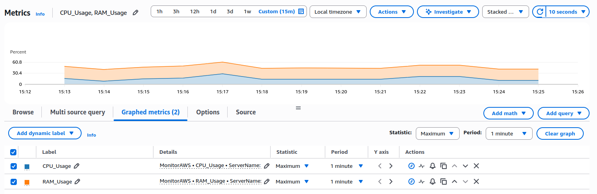

# AWS CloudWatch Monitoring Agent 

A lightweight Python agent that captures local system metrics (CPU & RAM) and transmits them to **AWS CloudWatch** for real-time monitoring and alerting.

## Features
- **Custom Metrics Agent:** A Python script that acts as a custom producer, collecting CPU & RAM usage via `psutil`.
- **Cloud Integration:** Seamlessly pushes data to **AWS CloudWatch** using the official `boto3` SDK.
- **Observability Ready:** Data structure allows for granular **CloudWatch Alarms** setup (e.g., triggering SNS emails on high CPU).
- **Security:** Designed to run with **IAM Roles** and least-privilege permissions, avoiding hardcoded credentials in the source code.

## Technologies
- **Python 3**
- **AWS SDK (Boto3)**
- **AWS Services:** CloudWatch, IAM, SNS.

## Setup & Installation

1. **Clone the repository**
   ```bash
   git clone https://github.com/FelipePoliszuk/aws-monitor-agent.git
   cd aws-monitor-agent
   ```

2. **Set up Virtual Environment**
   ```bash
   python3 -m venv venv
   source venv/bin/activate
   pip install -r requirements.txt
   ```

3. **Configure AWS Credentials**
   Ensure your IAM User has the **CloudWatchAgentServerPolicy** attached.
   ```bash
   aws configure
   ```

4. **Run the Agent**
   ```bash
   python monitor.py
   ```

## Dashboard Preview
